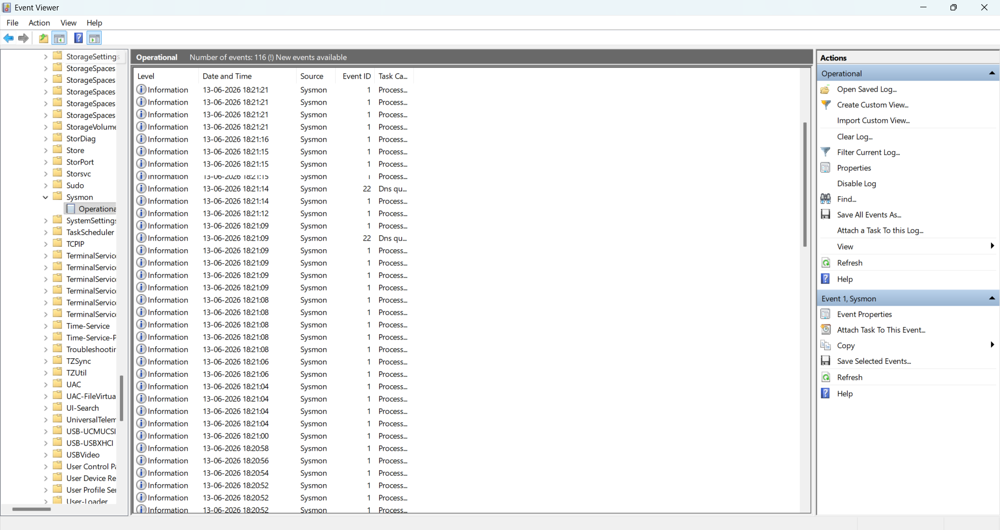
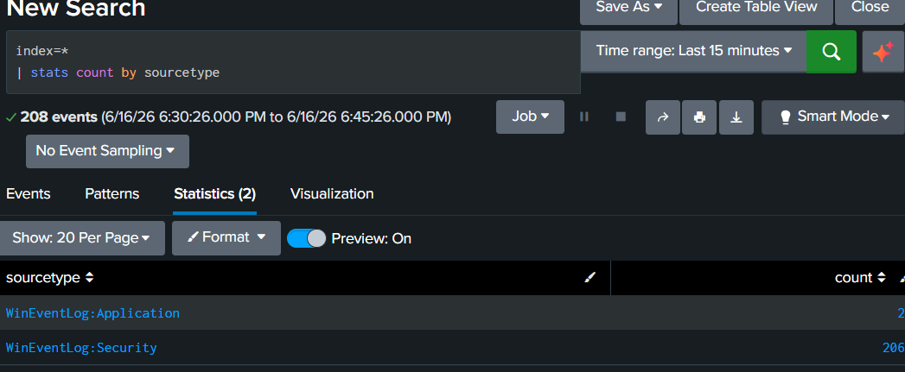
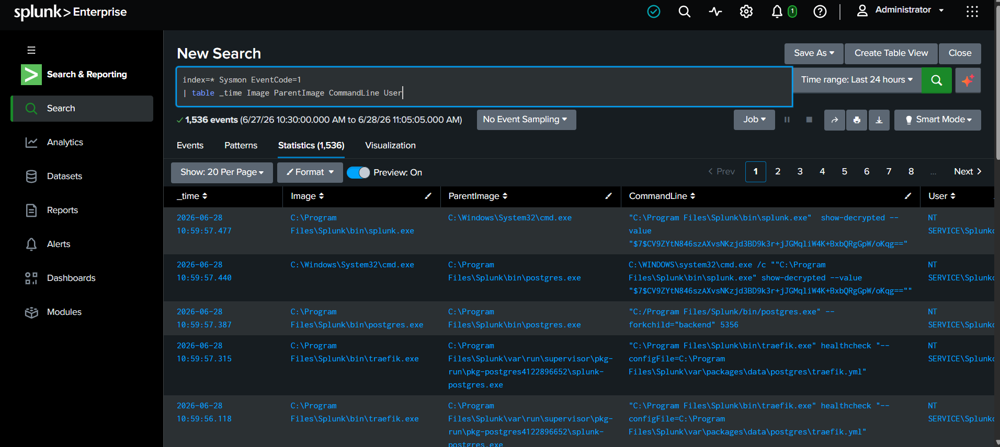
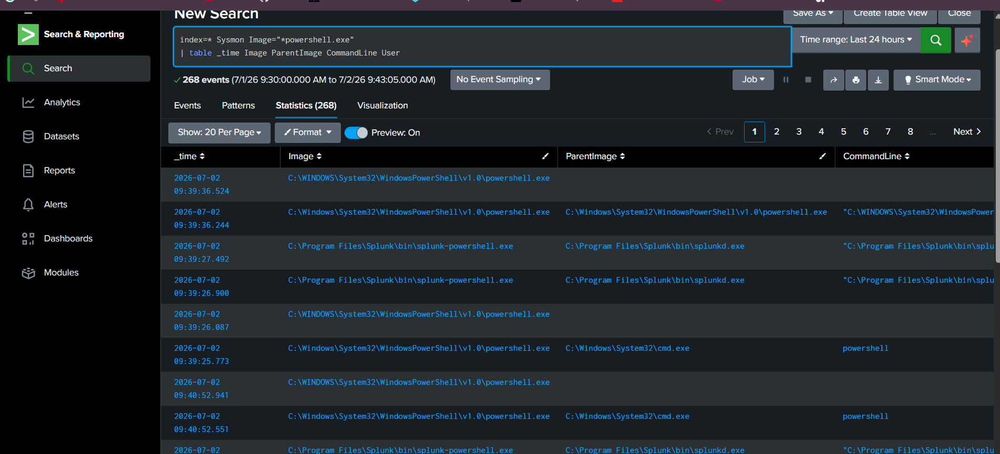
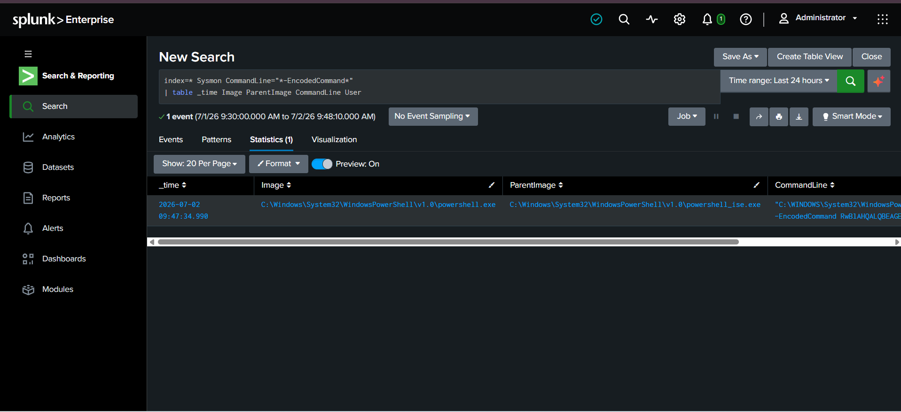
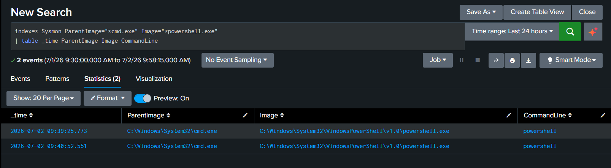
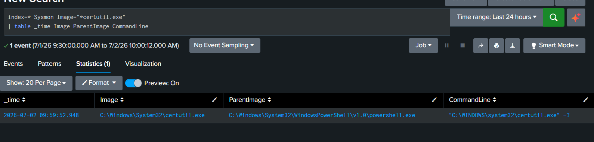
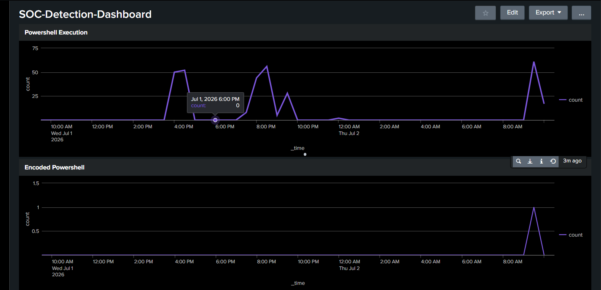
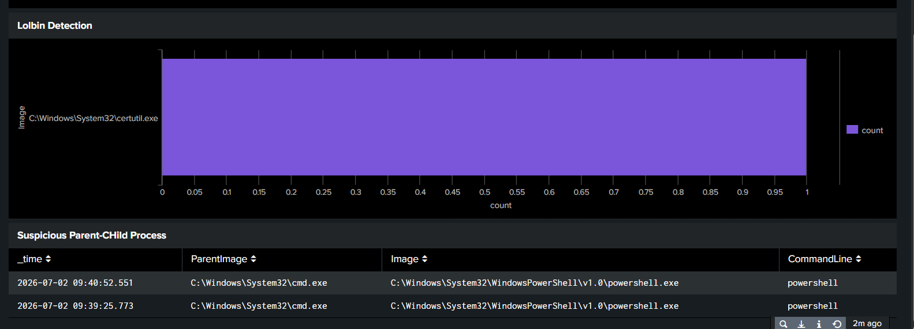
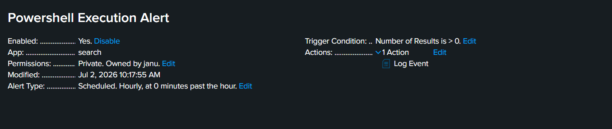

# SOC Detection Engineering Lab

## Overview

A Splunk Enterprise and Sysmon based Detection Engineering lab for monitoring Windows endpoint activity, developing security detections, creating dashboards, and validating alerts using real endpoint telemetry.

## Features
- Windows endpoint monitoring
- Sysmon log collection
- Splunk log ingestion
- Process creation monitoring
- PowerShell execution detection
- Encoded PowerShell detection
- Suspicious parent-child process detection
- LOLBin (Certutil) detection
- SOC dashboard creation
- Scheduled PowerShell alert

## Technologies Used
- Splunk Enterprise 10.4
- Sysmon
- Windows Event Logs
- Windows 11
- PowerShell
- Command Prompt

## Cybersecurity Concepts
- Detection Engineering
- SIEM Monitoring
- Endpoint Telemetry
- Threat Hunting
- Process Monitoring
- Windows Logging
- Alert Engineering
- Dashboard Development
- MITRE ATT&CK Framework
- Security Event Analysis

## Screenshots
### Sysmon Events Generated

### Log Ingestion Validation

### Process Creation Monitoring

### PowerShell Execution Detection

### Encoded PowerShell Detection

### Suspicious Parent-Child Process Detection

### LOLBin (Certutil) Detection

### SOC Dashboard

### PowerShell Execution Alert

